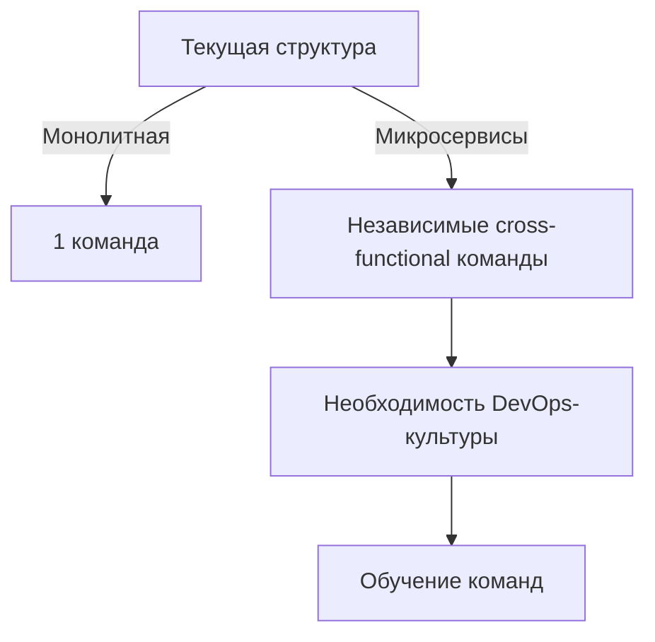

## Введение
Для крупного растущего интернет-магазина переход на микросервисы может стать стратегическим преимуществом, но требует тщательной подготовки. Разберём ключевые аспекты:

## Выгоды от перехода

### 1. **Бизнес-гибкость**
- **Ускорение time-to-market**  
  Независимые команды могут выпускать обновления для своих сервисов без согласования с другими отделами.
- **A/B-тестирование фич**  
  Возможность тестировать изменения в изолированных сервисах.

### 2. **Технические преимущества**
- **Точечное масштабирование**  
  Масштабирование только высоконагруженных сервисов 
- **Повышение отказоустойчивости**  
  Изоляция сбоев: падение сервиса рейтингов не влияет на процесс оплаты.
- **Полиглот-архитектура**  
  Выбор оптимальных технологий для разных задач

### 3. **Оптимизация ресурсов**
- **Эффективное использование инфраструктуры**  
  Контейнеризация + оркестрация (Kubernetes) даёт до 40% экономии ресурсов.
- **Гибкое распределение мощностей**  
  Критичные сервисы могут получать больше ресурсов автоматически.

## Ключевые проблемы и риски

### 1. **Организационные вызовы**

Критерии целесообразности перехода
Переход рекомендован если:
Текущий монолит ограничивает бизнес-рост

Есть потребность в частых обновлениях (> 5 релизов/мес)

Готовы инвестировать в платформу (1.5-2% годового IT-бюджета)

Команды готовы к DevOps-трансформации

Риски слишком высоки если:
Нет сильного архитектора/DevOps лида

80% разработчиков не имеют cloud-опыта

Заключение
Рекомендую: Начать с пилота на 1 сервисе при условии:

Формирования платформенной команды (3 DevOps + 1 SRE)

Выделения $200-300k на начальную инфраструктуру

Обучения 2 key-developers микросервисным паттернам

Ожидаемый ROI: 18-24 месяца за счёт:

30% увеличения скорости выпуска фич

40% снижения простоев в пиковые нагрузки

25% экономии на инфраструктуре после полного перехода
